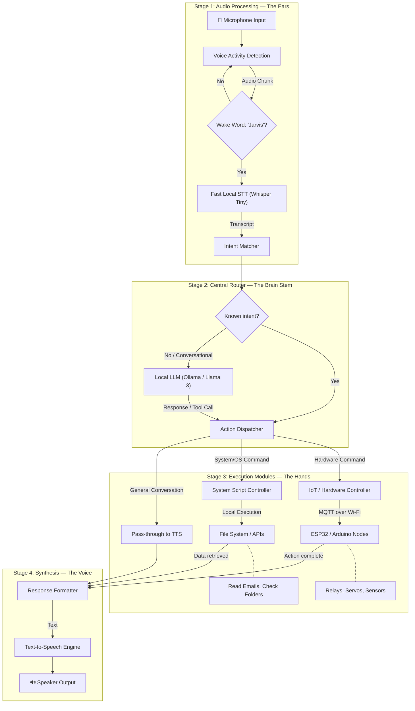

# Jarvis Pipeline Architecture

## System Overview



## Stage Breakdown

### Stage 01 — Voice Command (The Ears)
**Directory:** `stages/01-voice-command/`  
**Status:** ✅ Working  
**Runs standalone:** `node stages/01-voice-command/index.js`

Captures microphone audio, detects speech via dynamic VAD, checks for wake word, transcribes via Whisper (tiny/base/small models), and matches transcript against registered commands. Emits structured `intent` events.

**Interface (output):**
```javascript
commander.on('intent', (intent) => {
  // intent = { id: 'get_time', transcript: "what's the time", elapsed: 42, timestamp: ... }
});
```

---

### Stage 02 — Router (The Brain Stem)
**Directory:** `stages/02-router/`  
**Status:** 🔲 Planned

Receives intents from Stage 01. Routes known intents to execution modules (hardware, system). Routes unknown/conversational intents to the LLM.

**Interface (input):** Subscribes to Stage 01 `intent` events  
**Interface (output):** Emits `execute` events with target module + payload

---

### Stage 03 — Hardware Execution (The Physical Hands)
**Directory:** `stages/03-hardware/`  
**Status:** 🔲 Planned  
**Protocol:** MQTT over local Wi-Fi (Mosquitto broker)

Publishes commands to MQTT topics that ESP32/Arduino nodes subscribe to. Supports:
- Relay control (lights, fans, locks)
- Servo positioning (laser pointer, camera gimbal)
- Sensor reads (temperature, humidity → "Jarvis, how warm is it?")

**MQTT topic convention:** `jarvis/{room}/{device}`
```
jarvis/office/lights  → ON/OFF
jarvis/office/temp    → (sensor publishes readings)
jarvis/lab/servo      → { pan: 45, tilt: 30 }
```

---

### Stage 04 — System Execution (The Digital Hands)
**Directory:** `stages/04-system/`  
**Status:** 🔲 Planned

Handles OS-level and web-level requests:
- File system queries (download folder size, disk usage)
- Script execution (launch apps, run shell commands)
- API calls (email, calendar, weather)

---

### Stage 05 — LLM (The Higher Brain)
**Directory:** `stages/05-llm/`  
**Status:** 🔲 Planned  
**Backend:** Ollama running Llama 3 (or similar) locally

For open-ended questions: "Jarvis, how do I calculate the load resistor for this LED?"

---

### Stage 06 — TTS (The Voice)
**Directory:** `stages/06-tts/`  
**Status:** 🔲 Planned

Converts response text to speech and plays it back through the speaker. Candidates: Piper TTS (local, fast), macOS `say` command (quick prototype).

## Design Principles

1. **Each stage is independently testable** — has its own `package.json`, runs standalone
2. **EventEmitter interfaces** — stages communicate via events, not tight coupling
3. **100% local** — no cloud APIs, no subscriptions, no API keys
4. **Edge-ready** — designed to eventually run on Raspberry Pi / ARM
5. **Modular commands** — drop a `.js` file in `commands/` to add a new command
